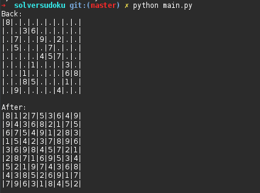

<!--
@Author: flo
@Date:   Sunday, March-12-2017, 22:28:59
@Email:  flo-github@outlook.fr
@Filename: README.md
@Last modified by:   flo
@Last modified time: Tuesday, March-14-2017, 22:54:30
-->

# Solver Sudoku

implementing the algorithm for resolve the sudoku in Python3

## Usage:

### main.py
- python3 main.py

